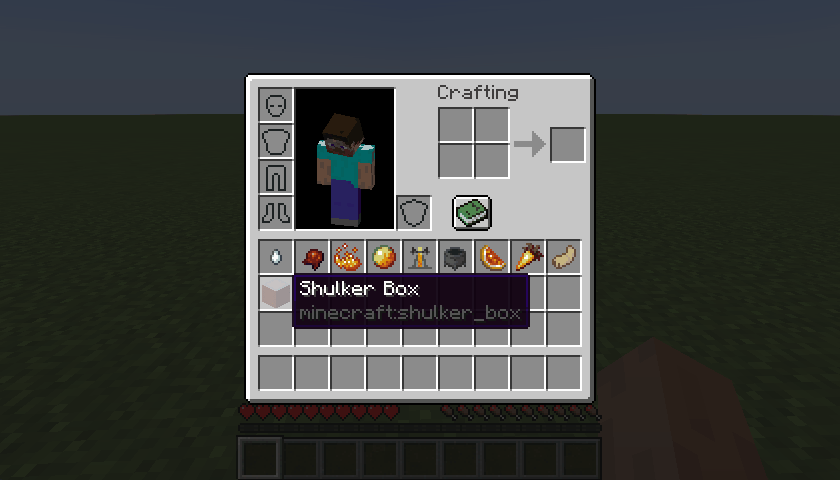
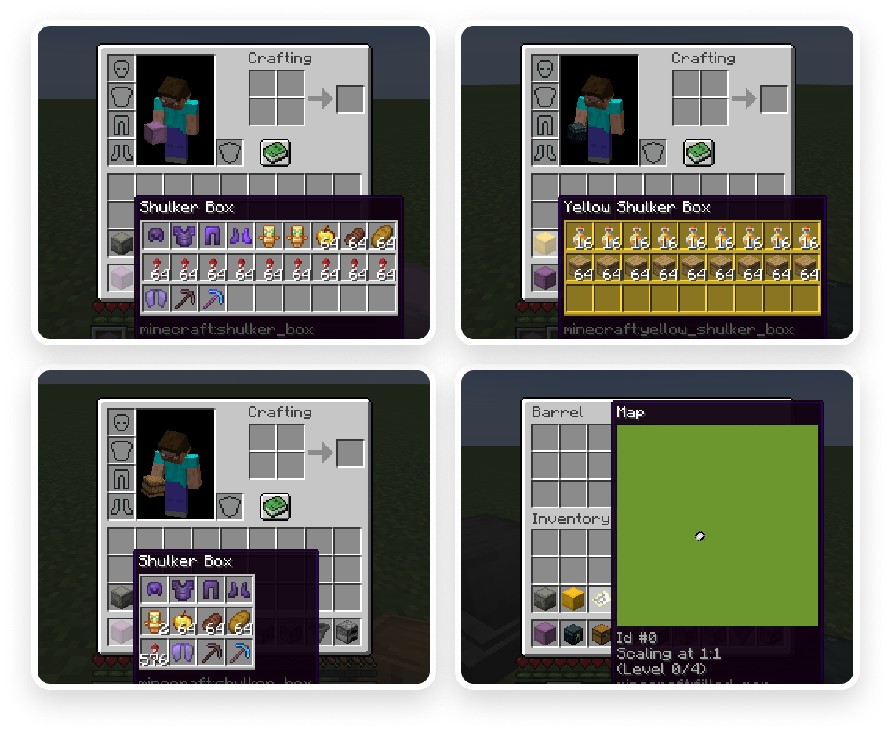

# Packed Inventory

[](https://github.com/Kir-Antipov/packed-inventory/actions/workflows/build-artifacts.yml)
[](https://github.com/Kir-Antipov/packed-inventory/releases/latest)
[](https://modrinth.com/mod/packed-inventory)
[](https://www.curseforge.com/minecraft/mc-mods/packed-inventory)
[](https://github.com/Kir-Antipov/packed-inventory/blob/HEAD/LICENSE.md)

A Minecraft mod that attempts to mitigate the ever-growing Inventory Problem by making it possible to manage the contents of shulker boxes, ender chests, and more directly from your inventory.

Oh, we also have fancy tooltips for shulker boxes, ender chests, maps, and beyond!

----

## Features

 - Manage the inventory of shulker boxes without ever placing them.
 - Manage the inventory of your ender chest without ever placing it.
 - Quickly move items into or out of shulker boxes, ender chests, and other inventory-providing items.
 - Access crafting tables, stonecutters, and other workstations directly from your inventory.
 - Vanilla-like tooltips for shulker boxes.
 - Vanilla-like tooltips for ender chests.
 - Vanilla-like tooltips for filled maps.
 - Vanilla-like tooltips for NBT-containing items acquired in Creative mode via `Ctrl + MMB`, such as chests, barrels, furnaces, hoppers, dispensers, droppers, and more.
 - An extensive and simple API that helps other modders implement these features for their blocks and items.

### Bundle-Like Functionality



As mentioned earlier, inventory-providing items *(e.g., shulker boxes, ender chests, and any items registered via the Packed Inventory API)* automatically gain bundle-like functionality, allowing you to quickly move items into or out of them.

To store items inside an inventory-providing item, you can either:
 - Pick up the inventory-providing item and press `k` on the item(s) to be stored, or
 - Pick up the inventory-providing item and press `k` on the inventory-providing item(s) to be stored, or
 - Pick up the item(s) to be stored and press `k` on the inventory-providing item.

To retrieve items from an inventory-providing item:
 - Pick up the inventory-providing item and press `k` on the empty slot(s) to extract the item(s) to, or
 - Pick up the inventory-providing item and press `l` or `ctrl + k` on the slot(s) to extract the item(s) to, or
 - Press `l` or `ctrl + k` on the inventory-providing item(s) to extract the items from.

To dump all items from an inventory-providing item out into the world:
 - Pick up the inventory-providing item, move it outside of the inventory frame, and press `k`.

### Tooltips

Here are some tooltip examples for you:

 - Container tooltip
 - Colored container tooltip
 - Compact container tooltip
 - Filled map tooltip



<sup>More screenshots can be found [here](media/).</sup>

----

## Key Binds

Key binds can be configured just like vanilla ones:

 1) Go to `Options`.
 2) Select `Controls`.
 3) Then choose `Key Binds`.
 4) Scroll down to the `Packed Inventory` section.
 5) Configure the available key binds.

| Name | Description | Default |
| ---- | ----------- | ------- |
| `Interact with item` | Interacts with the item in the active hotbar slot. Alternatively, if the inventory screen is open, interacts with the item the mouse is hovering over. Depending on the context, this action can either: <ul><li>Open a screen associated with the selected item,</li><li>Store an item inside the selected inventory-providing item,</li><li>Retrieve an item from the selected inventory-providing item, or</li><li>Dump all the items stored in the selected inventory-providing item out into the world</li></ul> | `k` |
| `Toggle interaction mode (hold)` | Makes the `Interact with item` key bind behave like `Extract from item` | `Left Control` |
| `Extract from item` | Extracts an item from the selected inventory-providing item | `l` |
| `Invert tooltip visibility (hold)` | Inverts tooltip visibility while pressed | `Left Shift` |
| `Invert tooltip compact mode (hold)` | Inverts tooltip compact mode while pressed | `c` |

Note that it's totally fine for these key binds to interfere with others since they are applied only when your inventory screen is open, where other key binds usually do not work.

----

## Config

If you have [Cloth Config](https://www.curseforge.com/minecraft/mc-mods/cloth-config) installed, you can customize the behavior of the mod. A config is usually located at `./config/packed-inventory.json` and by default looks like this:

```json
{
  "defaultTooltipConfig": {
    "showWhenEmpty": false,
    "rows": -1,
    "columns": -1,
    "usePredefinedColor": false,
    "enable": true,
    "compact": false
  },
  "tooltips": {
    "minecraft:shulker_box": {
      "showWhenEmpty": false,
      "rows": -1,
      "columns": -1,
      "usePredefinedColor": false,
      "enable": true,
      "compact": false
    },
    "minecraft:ender_chest": {
      "syncInterval": 5000,
      "showWhenEmpty": false,
      "rows": -1,
      "columns": -1,
      "usePredefinedColor": false,
      "enable": true,
      "compact": false
    },
    "minecraft:filled_map": {
      "size": 128,
      "enable": false,
      "compact": false
    }
  },
  "defaultValidationConfig": {
    "suppressValidationInCreative": true,
    "requiresPlayerOnGround": true,
    "enable": true
  },
  "validation": {
    "minecraft:shulker_box": {
      "suppressValidationInCreative": true,
      "requiresPlayerOnGround": true,
      "enable": true
    },
    "minecraft:ender_chest": {
      "requiresSilkTouch": true,
      "suppressValidationInCreative": true,
      "requiresPlayerOnGround": true,
      "enable": true
    }
  }
}
```

| Name | Description | Side | Default value |
| ---- | ----------- | ---- |------------- |
| `tooltip.enable` | Indicates whether this tooltip should be enabled by default | `client` | `true` |
| `tooltip.compact` | Indicates whether the compact mode should be enabled for this tooltip by default | `client` | `false` |
| `tooltip.showWhenEmpty` | Indicates whether this tooltip should be shown when its content is empty | `client` | `false` |
| `tooltip.rows` | Specifies the number of rows used to display the tooltip content | `client` | `-1` |
| `tooltip.columns` | Specifies the number of columns used to display the tooltip content | `client` | `-1` |
| `tooltip.usePredefinedColor` | Indicates whether this tooltip should use the item color | `client` | `false` |
| `tooltip.color` | Specifies the default tooltip color in case `usePredefinedColor` is set to `false` or the item color cannot be automatically determined | `client` | `NONE` |
| `tooltip.syncInterval` | Specifies the frequency at which synchronization should occur | `client` | `5000` |
| `tooltip.size` | Specifies the size of this tooltip, if applicable | `client` | `128` |
|​|​|​|​|
| `validation.enable` | Indicates whether the action associated with this validation rule should be allowed | `server` | `true` |
| `validation.suppressValidationInCreative` | Indicates whether this validation rule should be suppressed for creative players | `server` | `true` |
| `validation.requiresPlayerOnGround` | Indicates whether a player should be on the ground in order to satisfy this validation rule | `server` | `true` |
| `validation.requiresSilkTouch` | Indicates whether a player should have a tool enchanted with the Silk Touch enchantment in order to satisfy this validation rule | `server` | `true` |

You can edit any of these values directly in the config file or via [ModMenu](https://www.curseforge.com/minecraft/mc-mods/modmenu).

----

## Development

### Dependency Installation

To use the API, add `Packed Inventory` as a dependency in your build script:

`build.gradle`:

```gradle
repositories {
  maven {
    name = "Modrinth"
    url = "https://api.modrinth.com/maven"
    content {
      includeGroup "maven.modrinth"
    }
  }
}

dependencies {
  modImplementation "maven.modrinth:packed-inventory:${project.packed_inventory_version}"
}
```

`gradle.properties`:

```properties
packed_inventory_version=/* version (e.g., 0.3.0+1.20.4) */
```

### Entrypoints

The API introduces two new entrypoints that you can specify in your mod metadata:

|           Name            |                  Description                   |             Interface              |   Side   |
| ------------------------- | ---------------------------------------------- | ---------------------------------- | -------- |
| `packed-inventory`        | Will be run first and in any environment       | `PackedInventoryInitializer`       |   `*`    |
| `packed-inventory-client` | Will be run second and only on the client side | `PackedInventoryClientInitializer` | `client` |

`fabric.mod.json`:

```json
{
  "entrypoints": {
    "packed-inventory": [
      "a.b.c.MyMod"
    ],
    "packed-inventory-client": [
      "a.b.c.MyClientMod"
    ]
  }
}
```

### Inventory Views

Meet inventory views! This is the core concept of this mod that enables us to edit inventories provided by their respective items without ever interacting with their block forms.

Let's register a simple inventory viewer *(the component that provides inventory views)* for the ender chest item:

```java
public class MyMod implements PackedInventoryInitializer {
    @Override
    public void registerInventoryViewers(InventoryViewerRegistry registry, PackedInventoryApiConfig config) {
        registry.register(
            // We need to "extract" an inventory from the given context.
            // In this case, it's straightforward because ender chests have
            // a shared inventory that can be retrieved from the player.
            (inventory, slot, player) -> player.getEnderChestInventory(),

            // While this absolutely could be a predicate -
            // `(inventory, slot, player) -> inventory.getStack(slot).isOf(Items.ENDER_CHEST)`,
            // this form is preferred.
            Items.ENDER_CHEST
        );
    }
}
```

And that's it! You should be able to open the game, hover over an ender chest in your inventory, press `k`, and it will cause the inventory edit screen to pop up.

As for the next step, let's establish some rules to ensure our inventory viewer operates in a fair and non-cheaty way. To edit the ender chest inventory, a player should:

- Be on the ground, and
- Have a pickaxe enchanted with the Silk Touch enchantment, or
- Be in Creative mode.

To achieve this, we will use the `InventoryValidators` class, which contains some useful predefined inventory validators. Keep in mind that you can always create a new one from scratch.

```java
public class MyMod implements PackedInventoryInitializer {
    @Override
    public void registerInventoryViewers(InventoryViewerRegistry registry, PackedInventoryApiConfig config) {
        registry.register(
            (inventory, slot, player) -> player.getEnderChestInventory(),

            // isInCreative || isOnGround && hasSilkTouch
            InventoryValidators.IS_IN_CREATIVE.or(
                InventoryValidators.IS_ON_GROUND.and(InventoryValidators.HAS_PICKAXE_WITH_SILK_TOUCH)
            ),

            Items.ENDER_CHEST
        );
    }
}
```

We're getting there! Now, you will see a friendly error message when attempting to open an ender chest in midair and/or without a pickaxe enchanted with the Silk Touch enchantment. However, the moment you switch to Creative mode, all restrictions will disappear.

One last thing to do is to make our inventory viewer configurable. After all, we have the `config` parameter for a reason ;)

```java
public class MyMod implements PackedInventoryInitializer {
    @Override
    public void registerInventoryViewers(InventoryViewerRegistry registry, PackedInventoryApiConfig config) {
        // Let's register a validation config entry for the Ender Chest item.
        // The API provides these predefined configs (although you can create new ones):
        // - ValidationConfig: can be enabled/disabled.
        // - GenericValidationConfig: extends ValidationConfig, defines rules for being on the ground and suppressing validation for creative players.
        // - SilkTouchableGenericValidationConfig: extends GenericValidationConfig, defines a rule for having a Silk Touch tool in the inventory.
        config.registerValidationConfig(Items.ENDER_CHEST, SilkTouchableGenericValidationConfig::new);

        // Inventory viewer may be completely disabled by the user in the config.
        var isEnabled = InventoryValidators.config(Items.ENDER_CHEST, config, ValidationConfig.DEFAULT, ValidationConfig::isEnabled);

        // Suppress validation for creative players only if the config says so.
        var isInCreative = InventoryValidators.config(Items.ENDER_CHEST, config, GenericValidationConfig.DEFAULT, GenericValidationConfig::isSuppressedInCreative).and(InventoryValidators.IS_IN_CREATIVE);

        // Require the player to be on the ground only if the config says so.
        var isOnGround = InventoryValidators.config(Items.ENDER_CHEST, config, GenericValidationConfig.DEFAULT, x -> !x.requiresPlayerOnGround()).or(InventoryValidators.IS_ON_GROUND);

        // Require the player to have a Silk Touch tool in their inventory only if the config says so.
        var hasSilkTouch = InventoryValidators.config(Items.ENDER_CHEST, config, SilkTouchableGenericValidationConfig.DEFAULT, x -> !x.requiresSilkTouch()).or(InventoryValidators.HAS_PICKAXE_WITH_SILK_TOUCH);

        registry.register(
            (inventory, slot, player) -> player.getEnderChestInventory(),

            isEnabled.and(isInCreative.or(isOnGround.and(hasSilkTouch))),

            Items.ENDER_CHEST
        );
    }
}
```

This way, all restrictions can be configured via `ModMenu` or directly in the config file.

And after that, you've successfully integrated an item with `Packed Inventory`. Congratulations!

#### Inventory View Handlers

So, we've learned about inventory views, but where did that inventory edit screen come from? That's where the `InventoryViewHandler` comes in.

Most of the time, you do not need to register a custom handler if your inventory:

 - Implements `NamedScreenHandlerFactory`, or
 - Implements `ScreenHandlerFactory`, or
 - Has a conventional size *(i.e., 9, 18, 27, 36, 45, or 54)* that can be processed by a `GenericContainerScreenHandler`.

But, just as usual, you can register your own `InventoryViewHandler`:

```java
public class MyMod implements PackedInventoryInitializer {
    @Override
    public void registerInventoryViewHandlers(InventoryViewHandlerRegistry registry, PackedInventoryApiConfig config) {
        registry.register(
            (inventoryView, parentInventory, slot, player) -> {
                var name = parentInventory.getStack(slot).getName();
                var playerInventory = player.getInventory();
                var namedFactory = new SimpleNamedScreenHandlerFactory((sId, inv, p) -> new GenericContainerScreenHandler(ScreenHandlerType.GENERIC_9X3, sId, playerInventory, inventoryView, 3), name);

                player.openHandledScreen(namedFactory);
            },

            Items.ENDER_CHEST
        );
    }
}
```

Note that you are **not** limited to just opening a handled screen; you can literally do whatever you want with the provided inventory view.

#### Inventory Validation Failure Handlers

So, we can customize inventory view handling, but what about failure handling? Of course, you can tweak that too.

By default, errors are sent to the corresponding player's action bar, but you can change this behavior:

```java
public class MyMod implements PackedInventoryInitializer {
    @Override
    public void registerInventoryValidationFailureHandlers(InventoryValidationFailureHandlerRegistry registry, PackedInventoryApiConfig config) {
        registry.register(
            (failureReason, inventory, slot, player) -> {
                var text = failureReason.toText();
                if (text != null) {
                    player.sendMessage(text, false);
                }
            },

            Items.ENDER_CHEST
        );
    }
}
```

### Tooltips

What is good inventory management without descriptive tooltips? Let's create one for ender chests using `TooltipProvider`!

```java
// Note that tooltips are completely client-side, so we use
// `PackedInventoryClientInitializer` instead of `PackedInventoryInitializer` here.
public class MyClientMod implements PackedInventoryClientInitializer {
    @Override
    public void registerTooltipProviders(TooltipProviderRegistry registry, PackedInventoryApiConfig config) {
        registry.register(
            TooltipProvider.builder()
                .tooltipText((stack, context) -> List.of(Text.of("This is an ender chest")))
                .build()

            Items.ENDER_CHEST
        );
    }
}
```

This way, the ender chest's tooltip will be replaced with the text "This is an ender chest." However, this is not helpful, is it? The problem with ender chests is that the client does not have any information about their contents. So, is this a dead end? Of course not. We are going to use some *magic*:

```java
public class MyClientMod implements PackedInventoryClientInitializer {
    @Override
    public void registerTooltipProviders(TooltipProviderRegistry registry, PackedInventoryApiConfig config) {
        registry.register(
            TooltipProvider.builder()
                .useSyncData(GenericContainerTooltipSyncData::of)
                .tooltipData((stack, context, syncData) -> GenericContainerTooltipData.of(syncData.getInventory()))
                .build()

            Items.ENDER_CHEST
        );
    }
}
```

After specifying that our `TooltipProvider` needs `TooltipSyncData` *(in this case, I use the predefined `GenericContainerTooltipSyncData` because we only care about the ender chest's inventory)*, we can use it in the subsequent calls to `tooltipData`, `tooltipText`, etc. We'll delve into `TooltipSyncData` a bit later; for now, let's assume that everything just works.

Note that we override the ender chest's `TooltipData` with `GenericContainerTooltipData`. If you're not familiar with the vanilla treatment of this sort of things, when an item provides a `TooltipData`, Minecraft looks for a corresponding `TooltipComponent`. This component allows you to render anything you want inside a tooltip. `GenericContainerTooltipData` is provided by the API, so you don't need to worry about supplying the game with a tooltip component for it. However, if you want to use custom tooltip data, you'll need to register a tooltip component manually through Fabric API, like so:

```java
TooltipComponentCallback.EVENT.register(tooltipData -> {
    if (tooltipData instanceof MyTooltipData) {
        return new MyTooltipComponent((MyTooltipData)tooltipData);
    }
    return null;
});
```

Alright, now we have a fancy tooltip that shows us the contents of the ender chest. Once again, it's time to make everything configurable:

```java
public class MyClientMod implements PackedInventoryClientInitializer {
    @Override
    public void registerTooltipProviders(TooltipProviderRegistry registry, PackedInventoryApiConfig config) {
        // Let's register a tooltip config entry for the Ender Chest item.
        // The API provides these predefined configs (although you can create new ones):
        // - TooltipConfig: can be enabled/disabled; compact mode can be switched on or off.
        // - GenericTooltipConfig: extends TooltipConfig, defines properties commonly used by containers.
        // - GenericSyncedTooltipConfig: extends GenericTooltipConfig, defines the `syncInterval` property used by tooltip providers requiring synchronization data.
        config.registerTooltipConfig(Items.ENDER_CHEST, GenericSyncedTooltipConfig::new);

        registry.register(
            TooltipProvider.builder()
                // Tooltip can be enabled/disabled in the config or by the key bind (`Left Shift` by default)
                .when((stack, context) -> config.getTooltipConfigOrDefault(stack.getItem()).isEnabled())
                .useSyncData(GenericContainerTooltipSyncData::of)
                .tooltipData((stack, context, syncData) -> {
                    var cfg = config.getTooltipConfigOrDefault(stack.getItem());
                    var inventory = syncData.getInventory();
                    if (!cfg.shouldShowWhenEmpty() && inventory.isEmpty()) {
                        return null;
                    }

                    var color = cfg.usePredefinedColor() ? DyeColor.GRAY : cfg.color();
                    if (cfg.isCompact()) {
                        return GenericContainerTooltipData.ofZipped(inventory, cfg.rows(), cfg.columns(), color);
                    } else {
                        return GenericContainerTooltipData.of(inventory, cfg.rows(), cfg.columns(), color);
                    }
                })
                // Make the synchronization interval for this TooltipProvider configurable
                .syncInterval(stack -> config.getTooltipConfigOrDefault(stack.getItem(), GenericSyncedTooltipConfig.DEFAULT).syncInterval())
                .build(),

            Items.ENDER_CHEST
        );
    }
}
```

#### Tooltip Sync Data Providers

As mentioned earlier, to make the example above work, we need some information from the server. That's where `TooltipSyncData` and `TooltipSyncDataProviders` come into play.

We already use `GenericContainerTooltipSyncData` in our ender chest's tooltip provider, so let's go back to the server and teach it how to handle it:

```java
public class MyMod implements PackedInventoryInitializer {
    @Override
    public void registerTooltipSyncDataProviders(TooltipSyncDataProviderRegistry registry, PackedInventoryApiConfig config) {
        registry.register(
            // On the server side, we need to create the same TooltipSyncData
            // and populate it with contents that are not present on the client.
            // Everything else will be handled by Packed Inventory automatically.
            (stack, player) -> GenericContainerTooltipSyncData.of(player.getEnderChestInventory()),

            Items.ENDER_CHEST
        );
    }
}
```

With just a few lines of code, everything works as expected.

----

## Installation

Requirements:

 - Minecraft `1.20.x`
 - Fabric Loader `>=0.15.0`
 - Fabric API `>=0.83.0`

You can download the mod from:

 - [GitHub Releases](https://github.com/Kir-Antipov/packed-inventory/releases/latest)
 - [Modrinth](https://modrinth.com/mod/packed-inventory)
 - [CurseForge](https://www.curseforge.com/minecraft/mc-mods/packed-inventory)
 - [GitHub Actions](https://github.com/Kir-Antipov/packed-inventory/actions/workflows/build-artifacts.yml) *(these builds may be unstable, but they represent the actual state of the development)*

## Building from sources

Requirements:

 - JDK `17`

### Linux/MacOS

```cmd
git clone https://github.com/Kir-Antipov/packed-inventory.git
cd packed-inventory

chmod +x ./gradlew
./gradlew build
cd build/libs
```
### Windows

```cmd
git clone https://github.com/Kir-Antipov/packed-inventory.git
cd packed-inventory

gradlew build
cd build/libs
```
